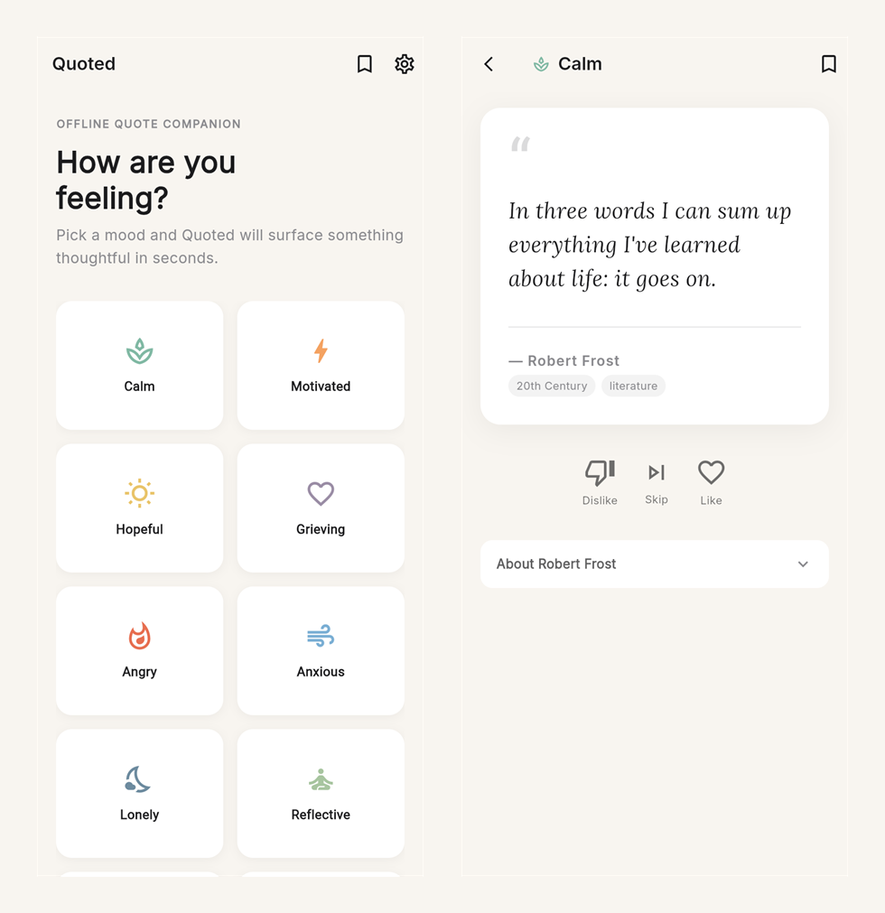

# Quoted

**A wise word for whatever mood you are in.**

[](https://github.com/dacheson/Quoted/actions/workflows/flutter-ci.yml)
[](LICENSE)
[](https://flutter.dev)

An offline-first Flutter app that serves quotes matched to how you are actually feeling. Choose a
mood, read, like or dislike to shape what comes next, and keep the ones worth returning to.

No account, no backend, no network calls. The entire dataset ships inside the app, so it works on
a plane and stores nothing about you anywhere but your own device.

## Live demo

Deployed to GitHub Pages from `main`: **https://dacheson.github.io/Quoted/**



## What it does

- **Ten moods** — calm, motivated, hopeful, grieving, angry, anxious, lonely, reflective, joyful
  and disciplined. Quotes are tagged by mood rather than filed under one category, so the same
  passage can surface for anger and for calm.
- **Learns as you go** — likes and dislikes persist across restarts and feed the ranking, so the
  selection narrows toward what actually lands for you.
- **Context on demand** — every quote carries its author, era and real source, expandable inline.
  The Marcus Aurelius entries cite the book of *Meditations* they came from, not just his name.
- **Favourites** — saved locally, available offline.
- **Handles running out** — exhausted and empty states are covered rather than left to fail.
- **Dark mode**, persisted.

## The quote dataset

`assets/quotes.json` holds 80 quotes from 67 authors. Every entry carries an author, era, themes,
applicable moods, a short biographical context and a real source reference — these are attributed
excerpts, not an unsourced scrape.

## Project layout

```
lib/models/      Quote, Mood and SessionState
lib/services/    quote selection and ranking, local persistence
lib/screens/     mood selection, quote flow, favourites, settings
lib/widgets/     quote card, mood button, expandable context, actions
lib/theme/       light and dark themes
assets/          the quote dataset
test/            unit and widget coverage for the above
```

## Running locally

```bash
flutter pub get
flutter run
```

Requires Flutter 3.10 or newer.

## Tests

```bash
flutter analyze
flutter test
```

Both run in CI on every push and pull request to `main`.

## How this was built

Quoted was an experiment in agent-led development. Most of the implementation was carried out by
GitHub Copilot's cloud agent, driven from the GitHub mobile app — issues and review comments in,
pull requests out, with no local development environment involved. The commit history reflects
that, and is left intact.

The interesting part was not the code generation. It was the orchestration: scoping each task
narrowly enough that a review could actually catch a mistake, deciding what to accept and what to
send back, and keeping a running definition of done. The ship-readiness checklist below was the
control surface for that.

## Ship-readiness

**Done**

- [x] Core quote flow across all ten moods
- [x] Favourites, likes/dislikes and dark mode persisted locally
- [x] Exhausted and empty states covered in the main flows
- [x] Final app icon and launch branding
- [x] Unit coverage for ranking, persistence and session state
- [x] Widget coverage for favourites, settings and mood selection
- [x] CI running `flutter analyze` and `flutter test`
- [x] Release signing configured from a gitignored key file or environment variables
- [x] Store copy, privacy disclosures and release notes in [`docs/release-prep.md`](docs/release-prep.md)
- [x] Web build deployed to GitHub Pages

**Outstanding — needs physical hardware**

- [ ] Smoke-test every mood flow on physical iOS and Android devices
- [ ] Verify the iOS archive/release configuration on macOS
- [ ] Capture store screenshots from release builds
- [ ] Produce and review a beta build for each platform

## Licence

[MIT](LICENSE)
